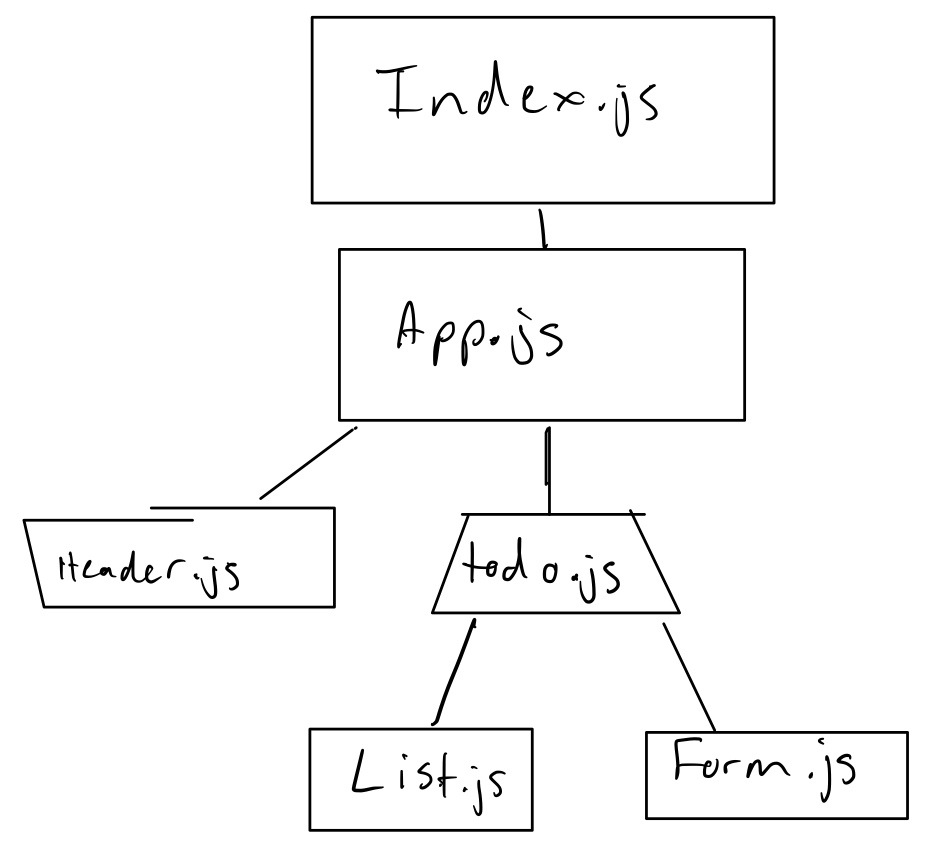

# LAB - Week 7

## Project: To Do

### Author: Joshua Williams

### Links and Resources
 - Repository: [GitHub Master](https://github.com/josh-williams-401-advanced-javascript/todo)
 - Resource: [React Bootstrap](https://react-bootstrap.netlify.app/) (GitHub Actions)


### Setup
```
git clone https://github.com/josh-williams-401-advanced-javascript/todo
cd todo
npm i
```


#### `.env` requirements (where applicable)

N/A

#### How to initialize/run your application (where applicable)
```
npm start
```

#### How to use your library (where applicable)
Add new items to the to-do list to see them pop up on the left. Click on items to watch the count go up and down and to see the style of the list items change.

#### Tests

There is one test that shows that typing in a new list item and clicking submit will render it to the screen.
```
npm test
```

#### UML



