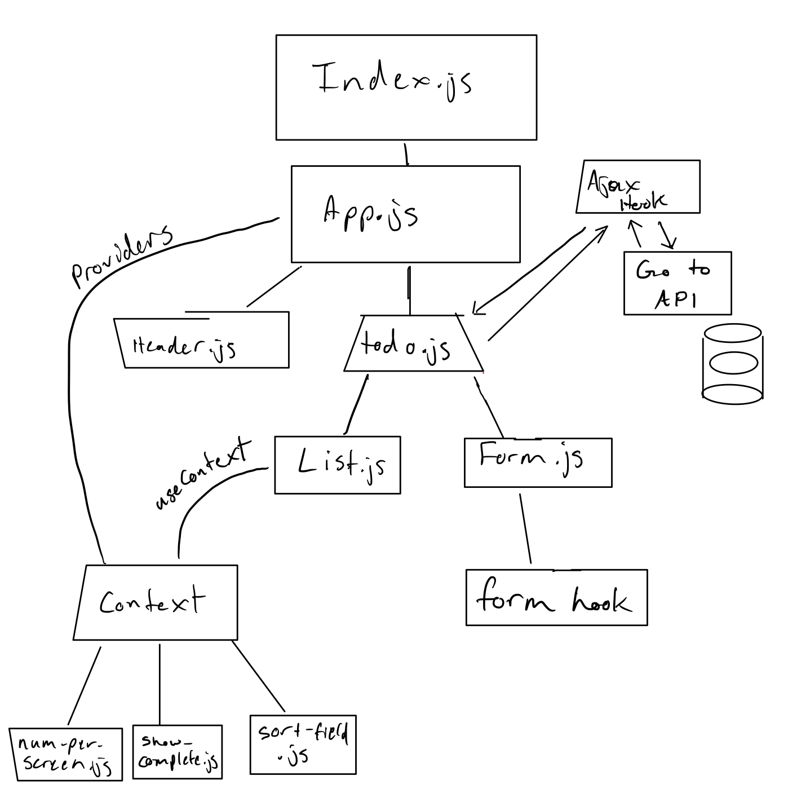

# LAB - Week 7

## Project: To Do

### Author: Joshua Williams

### Links and Resources
 - Repository: [GitHub Master](https://github.com/josh-williams-401-advanced-javascript/todo)
 - API: [Heroku API](https://josh-williams-api-server.herokuapp.com/api/v1/todo)
 - Resource: [React Bootstrap](https://react-bootstrap.netlify.app/)


### Setup
```
git clone https://github.com/josh-williams-401-advanced-javascript/todo
cd todo
npm i
```

#### `.env` requirements (where applicable)

N/A

#### How to initialize/run your application (where applicable)
```
npm start
```

#### How to use your library (where applicable)
Add new items to the to-do list to see them pop up on the right. Click on the pill on the top left of each card to watch the count go up and down and to see the style of the list items change. Delete an item by clicking the 'x' on the top right of each item.

To mess around with the app, change the initial `useState()` values of the files in the context folder, to see a different number of items per screen, whether the app shows completed items or not, and what the list items are sorted by.

#### Tests

I am having trouble writing tests in a reasonable amount of time.
```
npm test
```

#### UML



